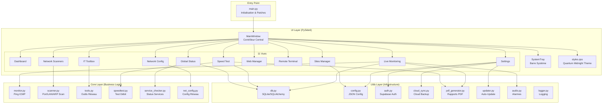
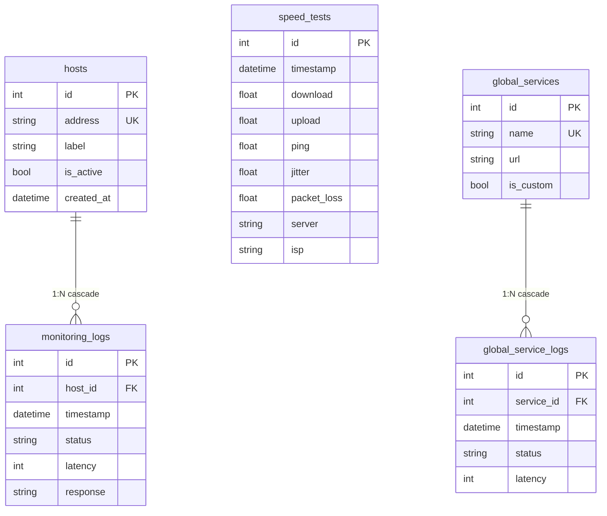

# 🔍 Analyse Complète — BahaaIT Network Tools v2.0.0

## 📋 Résumé Exécutif

**BahaaIT Network Tools** est une application desktop professionnelle de **monitoring réseau, diagnostic et gestion d'infrastructure** développée en **Python (PySide6/Qt)**. Elle cible les administrateurs réseau et techniciens IT qui ont besoin d'un outil tout-en-un pour surveiller leurs équipements, tester les performances réseau et gérer leur parc informatique.

> [!NOTE]
> L'application est actuellement **Windows-only** et distribuée via un installeur Inno Setup avec mise à jour automatique via GitHub Releases.

---

## 🏗️ Architecture de l'Application



---

## 📊 Inventaire Technique

### Stack Technologique

| Composant | Technologie |
|-----------|-------------|
| **Framework UI** | PySide6 (Qt 6 for Python) |
| **Base de données** | SQLite via SQLAlchemy ORM |
| **Authentification** | Supabase (email/password) |
| **Cloud Sync** | Supabase Storage |
| **Graphiques** | Qt Charts + PyQtGraph |
| **Réseau** | icmplib, scapy (optionnel), speedtest-cli, paramiko (SSH) |
| **Rapports** | ReportLab (PDF) |
| **Build** | PyInstaller + Inno Setup |
| **Distribution** | GitHub Releases (auto-update) |

### Structure du Projet

```
BahaaIT/
├── src/                          (~3,500 lignes de code Python)
│   ├── main.py                   ← Point d'entrée (86 lignes)
│   ├── config.json               ← Configuration développement
│   ├── core/                     ← Logique métier (6 modules, ~900 lignes)
│   │   ├── monitor.py            ← Monitoring ping ICMP continu
│   │   ├── scanner.py            ← Scan réseau (port, LAN, ARP, traceroute)
│   │   ├── tools.py              ← Boîte à outils réseau
│   │   ├── speedtest.py          ← Test de débit internet
│   │   ├── service_checker.py    ← Vérification status services cloud
│   │   └── net_config.py         ← Configuration réseau Windows
│   ├── ui/                       ← Interface utilisateur
│   │   ├── main_window.py        ← Fenêtre principale (409 lignes)
│   │   ├── system_tray.py        ← Icône zone de notification
│   │   ├── styles.qss            ← Thème sombre "Quantum Midnight"
│   │   └── widgets/              ← 15 vues/widgets (~3,200 lignes)
│   └── utils/                    ← Infrastructure (9 modules)
│       ├── db.py                 ← ORM SQLAlchemy (5 tables)
│       ├── auth.py               ← Authentification Supabase
│       ├── cloud_sync.py         ← Synchronisation cloud
│       ├── config.py             ← Gestion config JSON
│       ├── pdf_generator.py      ← Génération rapports PDF
│       ├── updater.py            ← Mise à jour automatique
│       ├── audio.py              ← Gestion alarmes sonores
│       ├── logger.py             ← Logging (fichier + UI)
│       └── admin.py              ← Gestion privilèges admin
├── assets/                       ← Ressources (icônes, sons)
├── build_scripts/                ← Scripts de build
│   ├── build.py                  ← Build automatisé
│   └── setup_compiler.iss        ← Installeur Inno Setup
├── BahaaIT.spec                  ← Config PyInstaller
├── requirements.txt              ← Dépendances Python (11 packages)
└── ROADMAP_2025.md               ← Feuille de route
```

---

## 🎯 Fonctionnalités Actuelles (11 Modules)

### 🟢 Monitoring & Surveillance

| Module | Description | Maturité |
|--------|-------------|----------|
| **Live Monitoring** | Ping ICMP continu multi-hôtes, alarmes sonores, event log, export PDF/CSV/TXT | ⭐⭐⭐⭐ |
| **Global Status** | Dashboard de 9+ services cloud (GitHub, AWS, Netflix, Discord...) avec sparklines historiques | ⭐⭐⭐ |
| **Dashboard** | Graphique bande passante temps réel (download/upload) | ⭐⭐ |

### 🔵 Outils Réseau

| Module | Description | Maturité |
|--------|-------------|----------|
| **Network Scanners** | Scan LAN (ARP/ICMP), scan de ports, traceroute avec résultats colorés | ⭐⭐⭐⭐ |
| **IT Toolbox** | 7 outils en onglets : Ping, Traceroute, NSLookup, Netstat, Whois, Port Checker, Load Balancing | ⭐⭐⭐⭐ |
| **Speed Test** | Test de débit avec jauges circulaires, graphiques live, sélection serveur, historique | ⭐⭐⭐⭐⭐ |
| **Network Config** | Configuration IP statique/DHCP/DNS sur interfaces Windows | ⭐⭐⭐ |

### 🟣 Gestion & Administration

| Module | Description | Maturité |
|--------|-------------|----------|
| **Web Manager** | Navigateur intégré pour panneaux admin réseau, bypass SSL pour IPs privées | ⭐⭐⭐ |
| **Remote Terminal** | Terminal SSH/Telnet/Serial avec parsing couleurs ANSI | ⭐⭐ |
| **Sites Manager** | CRUD équipements réseau, ping batch, import CSV, export PDF | ⭐⭐⭐ |
| **Settings** | Configuration globale, cloud sync, alarmes, autostart, mise à jour | ⭐⭐⭐⭐ |

### 🔧 Infrastructure

| Composant | Description |
|-----------|-------------|
| **Auto-Update** | Vérification GitHub Releases + téléchargement .exe avec barre de progression |
| **Cloud Sync** | Backup/restore config sur Supabase Storage (par utilisateur) |
| **PDF Reports** | Rapports brandés avec logo pour monitoring et speed test |
| **Alarm System** | Alarmes audio personnalisables (.wav) quand un host est DOWN |
| **System Tray** | Réduction en zone de notification avec menu contextuel |
| **Auth** | Login Supabase avec persistance de session locale |

---

## 🗄️ Schéma Base de Données



> [!NOTE]
> Nettoyage automatique des logs de plus de 30 jours au démarrage.

---

## ⚠️ Points Faibles Identifiés

### Sécurité
- 🔴 Clé API Supabase hardcodée dans le code source
- 🔴 Tokens de session stockés en clair (JSON)
- 🟠 Monkey-patch fragile du client Supabase (`re.match` bypass)
- 🟠 Login non imposé au démarrage (AuthManager créé mais non vérifié)

### Stabilité
- 🔴 Thread safety : mise à jour du header UI depuis un thread background
- 🔴 `QThread.terminate()` utilisé dans tools_view (risque de crash)
- 🟠 `bare except: pass` dans de nombreux endroits (erreurs silencieuses)
- 🟠 Bug : `self.logger` non défini dans `ServerListWorker` (crasherait)
- 🟠 Bug : `clear_log_btn` ajouté 2 fois dans monitor_view

### Architecture
- 🟠 Dashboard quasi vide (juste un graphique bandwidth)
- 🟠 Remote Terminal sans champs utilisateur/mot de passe
- 🟠 Double source de config (src/config.json vs %LOCALAPPDATA%)
- 🟡 Pas de `__init__.py` dans le dossier `core/`
- 🟡 Imports morts (`icmp_traceroute` importé mais jamais utilisé)

### Portabilité
- 🟡 100% Windows (netsh, tracert, registre, cp850)
- 🟡 Fenêtre taille fixe (pas d'adaptation DPI/résolutions variées)
- 🟡 Pas de framework i18n (textes mixtes français/anglais)

---

## 🚀 TOP 5 — Fonctionnalités & Améliorations Proposées

### 1. 🏠 Dashboard Interactif & Complet

**Problème** : Le dashboard actuel est quasi vide — juste un graphique de bande passante. C'est la première vue que l'utilisateur voit, mais elle ne donne aucune vue d'ensemble.

**Proposition** :

```
┌──────────────────────────────────────────────────────────┐
│                    DASHBOARD                              │
├─────────────┬─────────────┬─────────────┬────────────────┤
│  🟢 4/5     │  📊 85 Mbps │  ⏱️ 12ms    │  🌐 3/9       │
│  Hosts UP   │  Download   │  Latence    │  Services OK   │
├─────────────┴─────────────┴─────────────┴────────────────┤
│  📈 Graphique Bande Passante (existant)                  │
├──────────────────────┬───────────────────────────────────┤
│  🔔 Dernières Alertes │  📋 Résumé Équipements par Site  │
│  - 10:30 Host DOWN   │  Sablons: 4 équipements          │
│  - 10:25 Host UP     │  Paris: 2 équipements            │
├──────────────────────┴───────────────────────────────────┤
│  🕐 Dernier Speed Test : 85↓ / 20↑ Mbps  •  il y a 2h  │
└──────────────────────────────────────────────────────────┘
```

**Impact** : ⭐⭐⭐⭐⭐ — Transformation de l'expérience utilisateur dès l'ouverture

**Complexité** : Moyenne (les données existent déjà dans la DB)

---

### 2. 🔔 Système de Notifications Multi-Canal

**Problème** : Actuellement, les alertes sont uniquement sonores (alarm.wav). Un admin ne peut pas être notifié à distance quand un équipement tombe.

**Proposition** :
- **Notifications Desktop Windows** (toast notifications natives) en complément du son
- **Webhooks Discord/Telegram/Slack** : envoi automatique d'un message quand un host passe DOWN
- **Email SMTP** (optionnel) : rapport automatique d'incident
- **Configuration dans Settings** : activer/désactiver chaque canal, configurer les URLs webhook

```python
# Exemple d'intégration webhook
class NotificationManager:
    def notify(self, host, status, latency):
        if self.discord_enabled:
            self.send_discord_webhook(host, status, latency)
        if self.telegram_enabled:
            self.send_telegram_message(host, status, latency)
        if self.email_enabled:
            self.send_email_alert(host, status, latency)
```

**Impact** : ⭐⭐⭐⭐⭐ — Fonctionnalité critique pour usage professionnel

**Complexité** : Moyenne (librairies existantes, API webhook simples)

> [!TIP]
> Déjà prévu dans le [ROADMAP_2025.md](file:///c:/Users/user/Desktop/Création%20Site%20Web/BahaaIT/ROADMAP_2025.md) en haute priorité !

---

### 3. 🖥️ Remote Terminal Professionnel

**Problème** : Le terminal distant actuel n'a pas de champs utilisateur/mot de passe, tente une connexion avec `admin` + mot de passe vide, et ne supporte pas les profils de connexion.

**Proposition** :
- **Champs d'authentification** : Username, Password (avec show/hide), option clé SSH
- **Profils de connexion sauvegardés** : nom, type (SSH/Telnet/Serial), host, port, credentials
- **Intégration Sites Manager** : clic droit sur un équipement → "Ouvrir Terminal SSH"
- **Onglets multiples** : sessions parallèles comme PuTTY/MobaXterm
- **Terminal amélioré** : support complet des séquences ANSI (clear screen, cursor movement)

```
┌─────────────────────────────────────────────┐
│  [SSH ▼] [admin@192.168.1.1] [Port: 22]    │
│  [Username: admin] [Password: ••••]  [🔑]   │
│  [📁 Profils ▼] [Connect] [Disconnect]       │
├─────────────────────────────────────────────┤
│  [Tab: Router-HQ] [Tab: Switch-01] [+]      │
│  ┌─────────────────────────────────────────┐ │
│  │ admin@Router> show interfaces           │ │
│  │ GigabitEthernet0/0 is up, line proto... │ │
│  │ admin@Router> _                         │ │
│  └─────────────────────────────────────────┘ │
└─────────────────────────────────────────────┘
```

**Impact** : ⭐⭐⭐⭐ — Rend le terminal réellement utilisable en production

**Complexité** : Moyenne-Haute

---

### 4. 📊 Rapports & Analytics Avancés

**Problème** : Les rapports PDF sont basiques et il n'y a pas de vue analytique pour les données historiques (uptime, tendances, SLA).

**Proposition** :
- **Rapport d'Uptime** : pourcentage de disponibilité par host sur 7j/30j/90j avec graphiques
- **Tableau de bord SLA** : indicateurs visuels de conformité (99.9%, 99.99%)
- **Graphiques de tendance** : latence moyenne par jour, nombre d'incidents par semaine
- **Rapports planifiés** : génération automatique hebdomadaire/mensuelle
- **Export amélioré** : PDF brandé professionnel avec graphiques intégrés

```
┌──────────────────────────────────────────┐
│  📊 RAPPORT DE DISPONIBILITÉ — 30 JOURS │
├──────────┬───────────┬──────────────────┤
│ Host     │ Uptime %  │ Incidents        │
├──────────┼───────────┼──────────────────┤
│ 8.8.8.8  │ 99.98%  🟢│ 1 (durée: 8min) │
│ 10.10.1.1│ 97.50%  🟡│ 12 (durée: 18h) │
│ Router   │ 99.90%  🟢│ 3 (durée: 43min)│
├──────────┴───────────┴──────────────────┤
│  📈 [Graphique latence moyenne/jour]     │
│  📉 [Graphique incidents/semaine]        │
└──────────────────────────────────────────┘
```

**Impact** : ⭐⭐⭐⭐ — Valeur ajoutée énorme pour justifier l'outil auprès de clients/direction

**Complexité** : Moyenne (données déjà en DB, `get_uptime_stats()` est un stub prêt à implémenter)

---

### 5. 🛡️ Fiabilité & Qualité Logicielle

**Problème** : Plusieurs bugs identifiés, thread safety non garantie, gestion d'erreurs silencieuse.

**Proposition** (par ordre de priorité) :

#### 5a. Corrections Critiques
| Bug | Fichier | Correction |
|-----|---------|------------|
| `self.logger` non défini | [speedtest.py](file:///c:/Users/user/Desktop/Création%20Site%20Web/BahaaIT/src/core/speedtest.py) | Remplacer par `print()` ou logger proper |
| `QThread.terminate()` dangereux | [tools_view.py](file:///c:/Users/user/Desktop/Création%20Site%20Web/BahaaIT/src/ui/widgets/tools_view.py) | Utiliser un flag d'arrêt coopératif |
| Header stats depuis thread | [main_window.py](file:///c:/Users/user/Desktop/Création%20Site%20Web/BahaaIT/src/ui/main_window.py) | Utiliser signaux Qt |
| `clear_log_btn` doublé | [monitor_view.py](file:///c:/Users/user/Desktop/Création%20Site%20Web/BahaaIT/src/ui/widgets/monitor_view.py) | Supprimer le doublon |

#### 5b. Améliorations Robustesse
- Remplacer tous les `bare except: pass` par des `except SpecificException as e: logger.error(e)`
- Ajouter validation d'entrée IP dans config_view et sites_view
- Corriger le thread safety dans scanner_view (utiliser QThread au lieu de threading.Thread)
- Implémenter `get_uptime_stats()` (actuellement un stub `pass`)

#### 5c. Tests Automatisés
- Tests unitaires pour les modules core (ping, scan, tools)
- Tests d'intégration pour la base de données
- CI/CD pipeline pour build automatique

**Impact** : ⭐⭐⭐⭐⭐ — Stabilité et confiance utilisateur

**Complexité** : Variable (corrections critiques = faible, tests = moyenne)

---

## 📈 Matrice de Priorisation

| # | Fonctionnalité | Impact | Complexité | Priorité |
|---|---------------|--------|------------|----------|
| 1 | Dashboard Interactif | ⭐⭐⭐⭐⭐ | Moyenne | 🔴 Haute |
| 2 | Notifications Multi-Canal | ⭐⭐⭐⭐⭐ | Moyenne | 🔴 Haute |
| 3 | Remote Terminal Pro | ⭐⭐⭐⭐ | Haute | 🟠 Moyenne |
| 4 | Rapports & Analytics | ⭐⭐⭐⭐ | Moyenne | 🟠 Moyenne |
| 5 | Fiabilité & Qualité | ⭐⭐⭐⭐⭐ | Variable | 🔴 Haute |

> [!IMPORTANT]
> La priorité #5 (Fiabilité) devrait être traitée **en premier** car elle corrige des bugs existants qui peuvent causer des crashs. Ensuite, le Dashboard (#1) et les Notifications (#2) apporteront le plus de valeur visible.

---

## 🏆 Conclusion

BahaaIT Network Tools est une application **impressionnante en termes de fonctionnalités** pour un outil développé par une personne. Elle couvre un spectre large allant du monitoring réseau à la gestion d'équipements, en passant par les tests de performance et l'administration à distance.

Les **points forts** sont :
- 🎨 Design sombre premium ("Quantum Midnight") très professionnel
- 📦 Pipeline de build et distribution complet (PyInstaller → Inno Setup → GitHub Releases)
- 🔄 Système d'auto-update fonctionnel
- ☁️ Synchronisation cloud des configurations
- 📊 Speed Test avec jauges circulaires custom de qualité professionnelle

Les **5 améliorations proposées** transformeraient l'application d'un outil technique fonctionnel en une **suite professionnelle de niveau entreprise**, prête pour une utilisation par des équipes IT.
